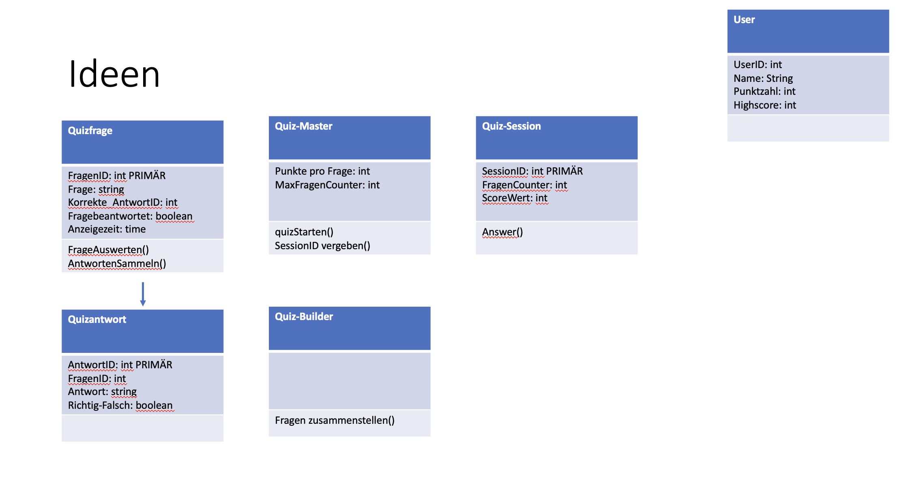
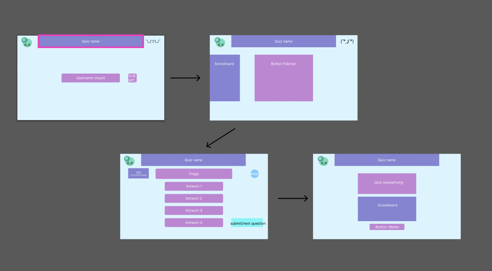

# Bootcamp_Quiz
## Creating a Quiz as the 2022 *Axel Springer* IT Azubis
#### We Started by creating an UML diagram while focusing mainly on the basics of making a Quiz.

#### After that we set up a JIRA board to create an Epic and follow up with the corresponding tasks/storys. 
 Here is how we did it
###### Our "Epic" on our JIRA board was simply ↓
>developing a quiz app
###### from then on out we created exactly 3 tasks/storys ↓
>quiz session, number of questions, Answering questions
###### after that we made sure to also create subtasks to each of the storys to specify the criteria for the quiz
#### Figma Sketch
###### in the meantime we also created a figma sketch designing the following pages for the quiz↓
>landing page, starting page, question pages, result page

#### Wiki
###### we also created a Wiki for our quiz which contains our figma sketch and the UML diagram
- [x] this did not work :( :crying: